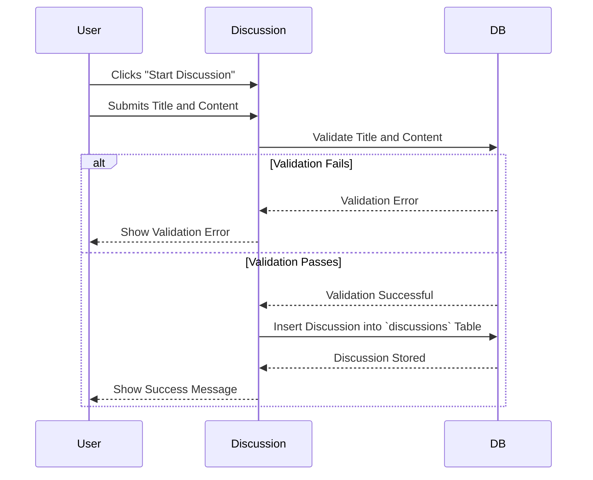
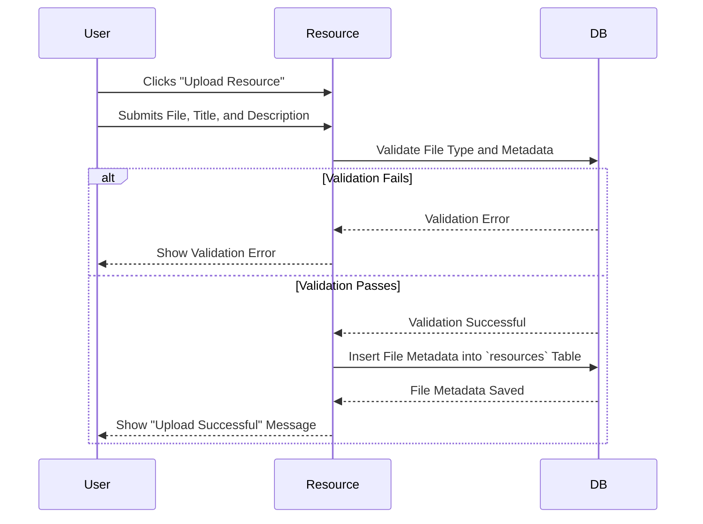
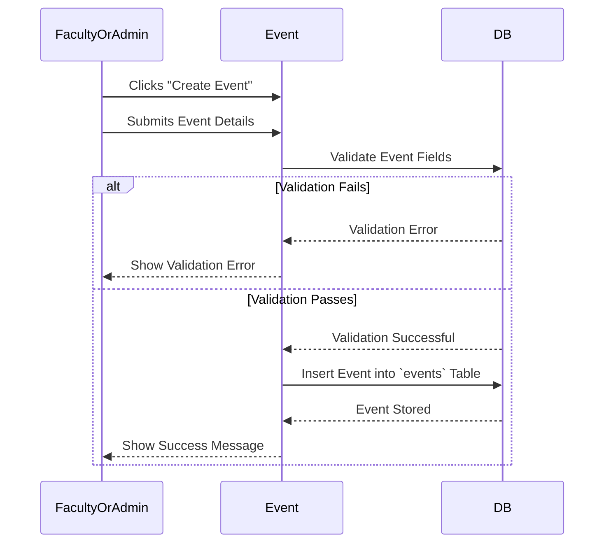

# Student Portal - Project Documentation

## Table of Contents
1. [Overview](#overview)
2. [Key Features](#key-features)
3. [Technologies Used](#technologies-used)
4. [System Processes](#system-processes)
   - [Start a Discussion Process](#start-a-discussion-process)
   - [Upload Academic Materials Process](#upload-academic-materials-process)
   - [Create Event Process](#create-event-process)
5. [Interface Designs](#interface-designs)
6. [Project Repository Structure](#project-repository-structure)
7. [Contributors](#contributors)
8. [Call for Mentorship & Investment](#call-for-mentorship--investment)

## Overview
The **Student Portal** is an integrated academic platform designed to enhance student engagement, collaboration, and resource accessibility. Our goal is to provide a seamless digital environment where students can:
- Discover **mentorship opportunities**
- Access **academic and educational resources**
- Organize and participate in **events and workshops**
- Receive **real-time university updates and notifications**
- Foster **collaborative learning** through discussions and shared knowledge

## Features
- **AI-Powered Chatbot** - Provides instant responses to student queries regarding university rules, events, and administrative guidance.
- **Event Management System** - Helps students track, RSVP, and receive recommendations for academic events such as seminars and workshops.
- **Mentorship & Collaboration** - Enables students to connect with peers, faculty, and alumni for mentorship and academic discussions.
- **Resource Sharing** - Allows users to upload, discover, and access study materials in a structured knowledge-sharing environment.
- **Centralized Dashboard** - Provides real-time notifications for college announcements, student affairs updates, and academic schedules.

**[View the Project Presentation](https://studentportal-grad.github.io/student-portal-docs/presentation.html)**

## Technologies Used
- **Backend:** Node.js with Express.js
- **Database:** Mongoose (MongoDB ORM)
- **Frontend:** Next.js (React Framework)
- **Mobile Development:** Flutter
- **Real-time Communication:** Socket.io
- **File Storage:** Local storage for storing files temporarily, with future plans to transition to cloud-based storage before deployment.
- **Artificial Intelligence:** Integration with an AI-powered chatbot using Natural Language Processing (NLP) models
- **Recommendation System:** Core recommendation engine for personalized user experiences

## **System Processes**  

This section outlines key system workflows through **sequence diagrams**, illustrating user, system, and external component interactions. These processes are crucial for the platform's **core functionality**, ensuring seamless **authentication**, **communication**, and **user engagement**.

> For additional workflows and a complete set of sequence diagrams, refer to the **[full repository](https://github.com/StudentPortal-grad/student-portal-docs/tree/main/0x09-Sequence_Diagrams)**. 

---

### **Start a Discussion Process**  

Starting a discussion enables **interactive communication** within a group, encouraging users to engage in academic or community-related topics. This workflow validates the title and content before storing the discussion, ensuring only well-formed and relevant content is uploaded.  

---

### **Upload Academic Materials Process**  

This process is key for ensuring that **academic resources** are uploaded, categorized, and stored correctly for user access. It includes validation checks to confirm that the uploaded files meet the necessary requirements, including file type and metadata, ensuring smooth integration into the system.  

---

### **Create Event Process**  

The process is essential for organizing academic and community-related events in the system. Faculty members or administrators can submit event details, which are validated to ensure all required fields are filled in correctly. If successful, the event is stored in the system and confirmed to the user.  

---

## Interface Designs
- **[Student Portal Application](https://studentportal-grad.github.io/student-portal-docs/0x10-Design/app_interface.html)** - A detailed view of the app's user interface, designed to provide a streamlined and intuitive student experience.
- **[Student Portal Dashboard](https://studentportal-grad.github.io/student-portal-docs/0x10-Design/website_interface.html)** - A visual representation of the admin dashboard interface, where administrators can control and manage all system functions.

## Project Repository Structure

| **Document** | **Description** |
|-------------|----------------|
| [Project Introduction](https://github.com/StudentPortal-grad/student-portal-docs/tree/main/0x00-Project_Introduction) | Provides an overview of the project, including its objectives, background, and motivation for development. Highlights the problem statement, expected impact and a comparison with existing platforms. |
| [Requirement Gathering](https://github.com/StudentPortal-grad/student-portal-docs/tree/main/0x01-Requirement_gathering) | Documents the user surveys, and analysis of user needs to define project goals. |
| [Requirements Definition](https://github.com/StudentPortal-grad/student-portal-docs/tree/main/0x02-Requirements_definition) | Lists both functional and non-functional requirements, defining what the system should do and performance constraints it must meet. |
| [Use Case Development](https://github.com/StudentPortal-grad/student-portal-docs/tree/main/0x03-Use_Case_Development) | Includes detailed use case diagrams and system workflows to illustrate interactions between users and the system. |
| [System DFD](https://github.com/StudentPortal-grad/student-portal-docs/tree/main/0x05-System_DFD) | Depicts the system's data flow and process structure, showing how data moves between components and external entities. |
| [Data Dictionary](https://github.com/StudentPortal-grad/student-portal-docs/tree/main/0x07-Data_dictionary) | Defines all the key data elements, their attributes, and constraints within the system database. |
| [Sequence Diagrams](https://github.com/StudentPortal-grad/student-portal-docs/tree/main/0x09-Sequence_Diagrams) | Shows step-by-step interactions between users and system components, helping visualize system operations over time. |
| [Project Initial Plan](https://github.com/StudentPortal-grad/student-portal-docs/blob/main/Initial_Plan.pdf) | Outlines the preliminary timeline, milestones, and key deliverables in the early stages of the project. |
| [Project Tools & Techniques](https://github.com/StudentPortal-grad/student-portal-docs/blob/main/Project_Tools_Technologies.pdf) | Lists the programming languages, frameworks, databases, and methodologies used in the project, along with their roles. |

## Contributors
### **Supervisors:**
- Dr. Nora Shoip and Dr. Ebtsam Adel
- Eng. Abdelrahman Khaled 

### **Project Team:**
- **Backend Developers:** Abdul Rahman Abu Zied, Tasbeeh Ismail, Omnia Gamal
- **Frontend Developers:** Abdul Rahman Ahmed Saad, Mona Alhusseiny
- **Mobile Developers:** Mina Zarif, Mo’men Ayman
- **Security Specialist:** Ziad Ahmed
- **AI Specialist:** Youssef Abdelmaksod
- **UI/UX Designer:** Noor Allam, Abdullah Mohammed

## Call for Mentorship & Investment
We are actively looking for **mentors, industry experts, and potential investors** from leading tech companies to guide and support our project. If you are interested in collaborating or providing feedback, please reach out to us.

**Contact Email:** [studentportal.team@gmail.com](mailto:studentportal.team@gmail.com)   
**GitHub Organization:** [Student Portal](https://github.com/StudentPortal-grad/)

---
